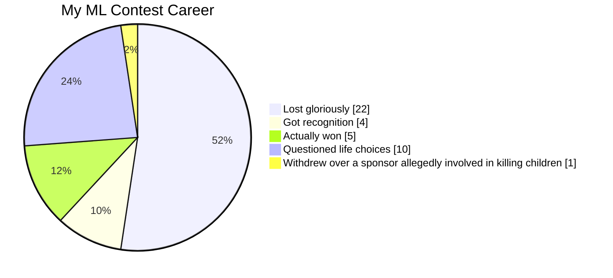

## Hi there, I'm Leo! 👋

### Geoscientist into computational geoscience, AI-ML, and using data to tackle energy challenges and subsurface problems.

- 🔭 Currently working with LLMs and AI agents in the energy space, building smarter workflows and tools for subsurface data
- 🤖 Deep-diving myself into how agentic systems can help automate and improve decision-making in real-world operations
- 🌱 Learning more about Agentic LLMs, Reinforcement Learning, Big Data, Parallel Computing, and playing around with dashboard vis
- 📫 You can reach me at [LinkedIn](https://www.linkedin.com/in/leo-dinendra-0988727b)

### and I'm still addicted to ML Contest!

Here is my completely unbiased performance summary:

## Featured Posts

- [My Post about ML, Computing, & Stuff in Geoscience on LinkedIn](https://www.linkedin.com/in/leo-c-0988727b/detail/recent-activity/shares/)
- [Tutorial on handling digital geoscience data in Python](https://github.com/leocd91/geodatahandling)
- [Geoscience Machine Learning Tutorial in Python using Pytorch](https://github.com/leocd91/geoscience-ML-tutorial)
- [My really really Old Blog about Computational Geophysics](http://redigitize.blogspot.com/)
